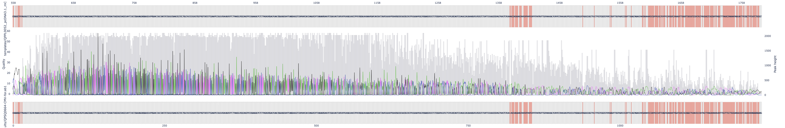

# PySanger Installation and User Manual

This repository has been adapted from [ponnhide/PySanger](https://github.com/ponnhide/PySanger) to allow alignment of Sanger Sequencing files to vector maps with file endings .gb .dna or .xdna

## Installation
1.  Install the following Python packages by  
	
	```sh
	conda create -n PySanger
	conda activate PySanger
	conda config --add channels defaults
	conda config --add channels bioconda
	conda config --add channels conda-forge
	
	conda install matplotlib seaborn plotly numpy biopython pandas snapgene-reader python-kaleido openpyxl
	```

	```sh
	git clone https://github.com/philipptrepte/PySanger.git
	```

2.  Set PYTHONPATH to the directory where you cloned the repository.

## API

### pysanger.py

- **alignment**_`(abidata=dict, template=str, strand=int)`_
	
	Run alignment of sanger sequencing result against a user-provided sequence or against a vector map.

	**Parameter**  	
	
	- **abidata**: *`dict`*  (default: None)  
	A dict object returned by 'abi_to_dict'.   
	- **template**: *`str`*  (default: None)  
	`template` can be nucleotide sequence or a file path to a vector map. Allowed file extensions are `.gb`, `.dna` and `.xdna`
	- **strand**: *`str`* (1 or -1, default: 1) 
	A sequencing strand used for the alignment and visualization. `1` indicates the plus strand. `-1` indicates the minus strand. 

	**Return**
	_tuple_

- **visualize**_`(alignment=tuple, region=str, fontsize=int, fig_width=int)`_ 
	
	Visualize a sanger sequencing result. 
	
	**Parameter**  	
	
	- **alignment**: *`tuple`* (tuple from alignment function)
	A tuple object after running the `alignment` function.

	- **region**: *`str`* ("all" or "aligned", default: "aligned")
	A region used for the visualization. If `all`, it will visualize the entire region of the `template` vector map and the `abidata` sequencing result. If `aligned`, it will visualize the minimum aligned region between the `template` and `abidata` sequencing result.

	- **fontsize**: *`float`* or *`int`*
	Fontsize of shown base pairs.

	**Return**
	_matplotlib.figure.Figure_

- **visualize_plotly**_`(alignment=tuple, region=str)`_
- 
  	Visualize a sanger sequencing result interactively
	
	**Parameter**

    - **region**: *`str`* ("all" or "aligned", default: "aligned")
	A region used for the visualization. If `all`, it will visualize the entire region of the `template` vector map and the `abidata` sequencing result. If `aligned`, it will visualize the minimum aligned region between the `template` and `abidata` sequencing result.

	- **fontsize**: *`float`* or *`int`*
	Fontsize of shown base pairs.

	**Return**
	_plotly.graph_objs.Figure_

### batch_alignment.py

- **batch_alignments**_`(setup=filepath, input_folder=folderpath, template_folder=folderpath)`_
	
	Aligns sequencing files to template files in parallel using multiple CPU cores.

	**Parameters**

	- **setup**: *`str`*
	File path to an `.xlsx` excel file containing the columns `Position`, `Sequencing_ID`, `Template`, `Primer`, `Strand`. Additional columns are allowed.

	- **input_folder**: *`str`*
	Folder path to `.abi` sanger sequencing files.

	- **template_folder**: *`str`*
	Folder path to `.dna`, `.xdna` or `.gb` vector map templates.

	**Return**
	_dict_
	A dictionary containing the alignments, where the keys are sample names and the values are alignment results.

- **summarise_results**_`(batch_alignments=dict, output_folder=str)`_
	
	Summarize the alignment results for each sample and write an excel file with the summary to an output folder.
	
	**Parameters**

	- **batch_alignments**: *`dict`*
	A dictionary containing the alignments, where the keys are Sequencing_IDs and the values are alignment results.

	- **output_folder**: *`str`*
	The folder where the alignment summary will be saved. Defaults to "output".

- **batch_visualization**_`(batch_alignments=dict, region=str, output_folder=str)`_
	
	Visualizes batch alignments and saves the alignment chromatograms as PDF files.

	**Parameters**

	- **batch_alignments**: *`dict`*
	A dictionary containing the alignments, where the keys are Sequencing_IDs and the values are alignment results.

	- **region**: *`str`* ("all" or "aligned", default: "aligned")
	The region of the alignment to visualize.

	- **output_folder**: *`str`*
	The folder where the alignment chromatograms will be saved. Defaults to "output".

### functions/helper.py

- **abi_to_dict**_`(filename=str)`_  
  
	Generate confidence value array and signal intensity arrays of each channel (A, T, G or C) at peak positions. 
	
	**Parameter**
	
	- **filename**: *`str`*  (default: None)  
	A file path of sanger sequencing result.   
	
	**Return**
	_dict_
	``` 
	{"conf": quality scores at peak positions.
	 "channel":{"A": signal intensities at peak positions in the channel for 'A',
	            "T": signal intensities at peak positions in the channel for 'T',
	            "G": signal intensities at peak positions in the channel for 'G',
	            "C": signal intensities at peak positions in the channel for 'C'}
	}
	```

- **generate_consensusseq**_`(abidata=dict)`_

	Generate the most consensus seq from a senger sequencing result.  

	**Parameter**
	
	- **abidata**: *`dict`*  (default: None)  
	A dict object returned by 'abi_to_dict'.   
	
	**Return**
	_tuple_
	`(str:Forward strand sequence (5'->3'), str:Reverse strand sequence (5'->3'))` 

- **generate_pwm**_`(abidata=dict)`_

	Generate position weight matrix based on signal intensities of each channel.   
	
	**Parameter**
	
	- **abidata**: *`dict`*  (default: None)  
	A dict object returned by 'abi_to_dict'.   

	**Return**
	_pandas.DataFrame_

- **adjust_quality_scores**_`(tasubject=str, quality_scores=list)`_

	Inserts `-1` in quality scores at insertion positions observed after alignment of `abidata` with `template`

	**Parameters**

	- **tasubject**: *`str`* (default: tasubject)
	A trimmed and aligned nucleotide string.

	- **quality_scores**: *`list`* (default: _abidata["conf"])
	A list of quality scores at peak positions from the sanger sequencing result.

	**Return**
	_list_

- **align_row**_`(row=pandas.Series, input_folder=str, template_folder=str)`_

	Aligns a sequencing file to a template file on a specified strand based on information in the setup excel file.

	**Parameters**

	- **row**: *`pandas.Series`*
	A pandas Series object representing a row of data.

	- **input_folder**: *`str`*
	The path to the folder containing the .abi sequencing file.

	- **template_folder**: *`str`*
	The path to the folder containing the .dna, .xdna or .gb vector map templates.


## Example usage 

Visualise peack intensities from a Sanger sequencing result. You can use the example by `ponnhide/PySanger` where you use as `abidate` the `.ab` file `BE MAFB5.ab1` and as `query` the sequence `AGCCGGCTGGCTGCAGGCGT`.

Alternatively, can you as `abidata` the file `seq_results/QPSQ0664-CMV-for.ab1` and as `template` the vector map file `templates/QPPL0052_pcDNA3.1_mCitrine-C1-GW.dna`

### region = "aligned"
```python
from pysanger import * 
align        = alignment(abidata="seq_results/BE MAFB5.ab1", template="AGCCGGCTGGCTGCAGGCGT")
fig	         = visualize(align, region = "aligned", fontsize = 5)

fig.savefig("test_aligned.png", bbox_inches="tight") 
```


### region = "all"
``` python
from pysanger import * 
align        = alignment(abidata="seq_results/QPSQ0664-CMV-for.ab1", template="templates/QPPL0052_pcDNA3.1_mCitrine-C1-GW.dna")
fig          = visualize(align, region="all")

fig.savefig("test_all.png", bbox_inches="tight") 
```


### interactive PyPlot .html files
``` python
from pysanger import *
align        = alignment(abidata="seq_results/QPSQ0664-CMV-for.ab1", template="templates/QPPL0052_pcDNA3.1_mCitrine-C1-GW.dna")
fig          = visualize_plotly(align, region="aligned")

pio.write_html(fig, file="test_plotly_aligned.html", auto_open=True)
```




### Run and visualize batch alignments and create a summary table
``` python
import pandas as pd
from batch_alignment import batch_alignments, summarise_results, batch_visualization

batch 			= batch_alignments(setup="seq_results/Sequencing_setup.xlsx", input_folder="seq_results", template_folder="templates")
summary 		= summarise_results(batch)
batch_visualization(batch, region="aligned", output_folder="output")

print(summary)
```

**Alignment with chromatogram**


**Summary Table**


